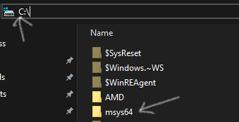
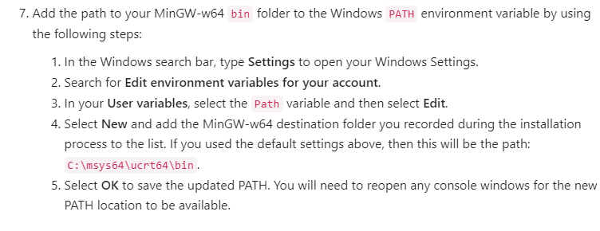
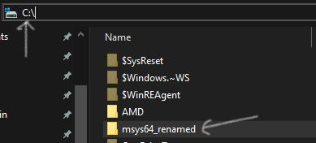
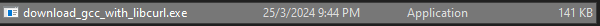
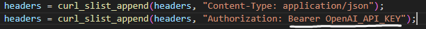
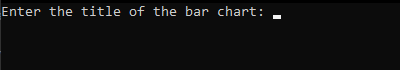

<!-- Improved compatibility of back to top link: See: https://github.com/othneildrew/Best-README-Template/pull/73 -->
<a name="readme-top"></a>
<!--
*** Thanks for checking out the Best-README-Template. If you have a suggestion
*** that would make this better, please fork the repo and create a pull request
*** or simply open an issue with the tag "enhancement".
*** Don't forget to give the project a star!
*** Thanks again! Now go create something AMAZING! :D
-->


<!-- PROJECT SHIELDS -->
<!--
*** I'm using markdown "reference style" links for readability.
*** Reference links are enclosed in brackets [ ] instead of parentheses ( ).
*** See the bottom of this document for the declaration of the reference variables
*** for contributors-url, forks-url, etc. This is an optional, concise syntax you may use.
*** https://www.markdownguide.org/basic-syntax/#reference-style-links
-->
[![Contributors][contributors-shield]][contributors-url]
<!-- [![Forks][forks-shield]][forks-url]
[![Stargazers][stars-shield]][stars-url]
[![Issues][issues-shield]][issues-url]
[![MIT License][license-shield]][license-url]
[![LinkedIn][linkedin-shield]][linkedin-url]
 -->


<!-- PROJECT LOGO -->
<br />
<div align="center">
  <a href="https://github.com/github_username/repo_name">
    
  </a>

<h3 align="center">Horizontal Bar Chart Generator</h3>

  <p align="center">
    Introducing our latest project developed in C: a sophisticated tool designed to effortlessly generate Horizontal Bar Charts within your terminal interface. With a user-friendly interface, customization options, and the ability to save charts to text files, it streamlines the data visualization process. Additionally, it offers sorting capabilities, vibrant color options, and seamless CSV import/export functionality, making it a comprehensive solution for diverse data visualization needs. What sets our project apart is its integration with the OpenAI ChatGPT API, allowing for enhanced analysis directly within the workflow. From simple tasks to complex analyses, our project provides professionals with the tools they need to visualize data effectively and make informed decisions.
    <br />
    <a href="https://github.com/FATBO1/c_project"><strong>Explore the docs »</strong></a>
    <br />
  </p>
</div>


<!-- TABLE OF CONTENTS -->
<details>
  <summary>Table of Contents</summary>
  <ol>
    <li>
      <a href="#about-the-project">About The Project</a>
      <ul>
        <li><a href="#built-with">Built With</a></li>
      </ul>
    </li>
    <li>
      <a href="#getting-started">Getting Started</a>
      <ul>
        <li><a href="#prerequisites">Prerequisites</a></li>
    </li>
    <li><a href="#usage">Usage</a></li>
    <li><a href="#Basic Features">Basic Features</a></li>
    <li><a href="#Additonal Features">Additonal Features</a></li>

  </ol>
</details>


<!-- ABOUT THE PROJECT -->
## About The Project

![Product Name Screen Shot][product-screenshot]
<p>Allows users to create Horizontal Bar Charts with various other useful features (covered in the sections below)</p>

## Basic Demo
https://github.com/FATBO1/c_project/assets/98154744/038b2158-5ee5-4227-991c-9d63bf5e5477


<p align="right">(<a href="#readme-top">back to top</a>)</p>


### Built With
* ![JQuery][c.com]

<p align="right">(<a href="#readme-top">back to top</a>)</p>


<!-- GETTING STARTED -->
## Getting Started
### Prerequisites
- Required OS: Windows
- Installed MinGW containing msys64 folder (To use GCC to build files)
  - If you have not done so, please follow the instructions in this link https://code.visualstudio.com/docs/cpp/config-mingw
  - Make sure after installation the msys64 folder is under C:\ 
  - 
  - Make sure that this step is completed (Screenshot is from the URL above)
  - 


### Step 1
- Clone the repository into a directory or simply download the zipped file and unzip it

### Step 2
- Go to "C:\" directory on file explorer
  - Find the "msys64" and rename it to something else (we will use the msys64 that is provided in this repo) 
  - 

### Step 3
- Go to where you have clone the repo or where you have unzip it to locate "download_gcc_with_libcurl.exe"
  - Double click on it to launch the exe. This will copy a new "msys64" folder with the required files to "C:\" directory. 
  - 
  - This step is crucial in order to ensure curl and libcurl is installed correctly, this is required to run the OpenAI ChatGPT API

### Step 4
- Go to where you have clone the repo or where you have unzip it to locate "gpt_api.h"
  - Open it in VSC or a text editor
    - Find "Authorization: Bearer " text in the file and replace the "OpenAI_API_KEY" placeholder with the actual API KEY from OpenAI API 
    - 

### Step 5
- Go to where you have clone the repo or where you have unzip it to locate "main.c", we are going to build it now with cJSON and libcurl
- Open the repo in Windows Terminal
  - Tip* You can do it by navigating to the repo in your file explorer and type "cmd" in the search bar
  - In Windows Terminal enter this command to build the main.c
  ```sh
  gcc main.c -o main cJSON/cJSON.c -lcurl
  ```
### Step 6
- Go to where you have clone the repo or where you have unzip it to locate "main.exe", we are going to launch the application at last !
  - Double click on "main.exe" to launch the application, a new Windows Terminal should appear and the application should be running now
  - You should see this... Simply follow the instructions to generate bar charts and play with the features we have added !
  -  


<p align="right">(<a href="#readme-top">back to top</a>)</p>


<!-- USAGE EXAMPLES -->
## Usage
Simply launch the main.exe file again to launch the application

<p align="right">(<a href="#readme-top">back to top</a>)</p>

<!-- ROADMAP -->


## Basic Features

- Input various data to create bar charts
  - Name of Title
  - Number of Categories
  - Category Value
  - Name of X axis
- Sort charts according to alphabetical order or bar length
- Save charts to text files
  - Users can determine the file name
- Input validation by the program which displays appropriate error messages


<p align="right">(<a href="#readme-top">back to top</a>)</p>


## Additional Features

- Statistical Analysis Options
- OpenAI ChatGPT API for analysis
- Modify the chart after it is printed
- Allow Users to choose colours of the bar chart
- Import and Export to CSV
- Coloured Bar charts
- Create New Chart
- Exit Program

<p align="right">(<a href="#readme-top">back to top</a>)</p>


<p align="right">(<a href="#readme-top">back to top</a>)</p>


<!-- MARKDOWN LINKS & IMAGES -->
<!-- https://www.markdownguide.org/basic-syntax/#reference-style-links -->
[contributors-shield]: https://img.shields.io/github/contributors/FATBO1/c_project.svg?style=for-the-badge
[contributors-url]: https://github.com/FATBO1/c_project/graphs/contributors
[forks-shield]: https://img.shields.io/github/forks/github_username/repo_name.svg?style=for-the-badge
[forks-url]: https://github.com/github_username/repo_name/network/members
[stars-shield]: https://img.shields.io/github/stars/github_username/repo_name.svg?style=for-the-badge
[stars-url]: https://github.com/github_username/repo_name/stargazers
[issues-shield]: https://img.shields.io/github/issues/github_username/repo_name.svg?style=for-the-badge
[issues-url]: https://github.com/github_username/repo_name/issues
[license-shield]: https://img.shields.io/github/license/github_username/repo_name.svg?style=for-the-badge
[license-url]: https://github.com/github_username/repo_name/blob/master/LICENSE.txt
[linkedin-shield]: https://img.shields.io/badge/-LinkedIn-black.svg?style=for-the-badge&logo=linkedin&colorB=555
[linkedin-url]: https://linkedin.com/in/linkedin_username
[product-screenshot]: images/product_ss.png
[Next.js]: https://img.shields.io/badge/next.js-000000?style=for-the-badge&logo=nextdotjs&logoColor=white
[Next-url]: https://nextjs.org/
[React.js]: https://img.shields.io/badge/React-20232A?style=for-the-badge&logo=react&logoColor=61DAFB
[React-url]: https://reactjs.org/
[Vue.js]: https://img.shields.io/badge/Vue.js-35495E?style=for-the-badge&logo=vuedotjs&logoColor=4FC08D
[Vue-url]: https://vuejs.org/
[Angular.io]: https://img.shields.io/badge/Angular-DD0031?style=for-the-badge&logo=angular&logoColor=white
[Angular-url]: https://angular.io/
[Svelte.dev]: https://img.shields.io/badge/Svelte-4A4A55?style=for-the-badge&logo=svelte&logoColor=FF3E00
[Svelte-url]: https://svelte.dev/
[Laravel.com]: https://img.shields.io/badge/Laravel-FF2D20?style=for-the-badge&logo=laravel&logoColor=white
[Laravel-url]: https://laravel.com
[Bootstrap.com]: https://img.shields.io/badge/Bootstrap-563D7C?style=for-the-badge&logo=bootstrap&logoColor=white
[Bootstrap-url]: https://getbootstrap.com
[JQuery.com]: https://img.shields.io/badge/jQuery-0769AD?style=for-the-badge&logo=jquery&logoColor=white
[JQuery-url]: https://jquery.com 
[C.com]: images/c.png
